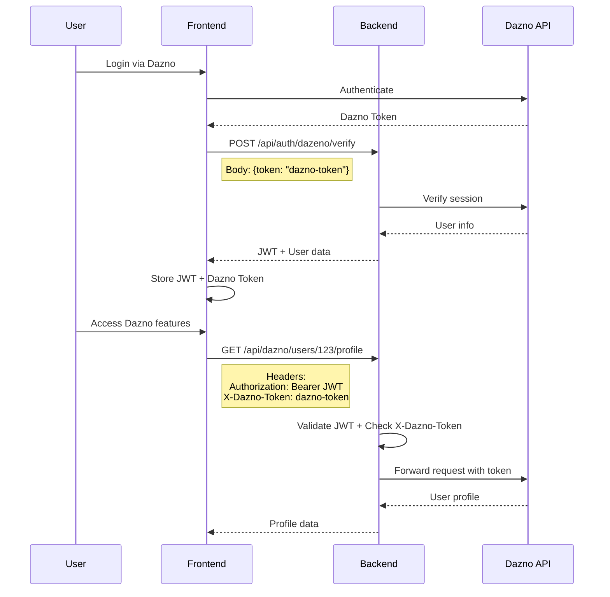

# Guide d'Intégration Frontend - Header X-Dazno-Token

## 🔐 Configuration Requise

Le backend attend maintenant le header `X-Dazno-Token` pour toutes les routes `/api/dazno/**`.

## 📝 Exemples d'Implémentation

### 1. Service API Frontend (TypeScript/React)

```typescript
// services/daznoAPI.ts
class DaznoAPIService {
  private daznoToken: string | null = null;
  private baseURL = process.env.NEXT_PUBLIC_API_URL || 'http://147.79.101.32:3000';

  // Stocker le token Dazno après l'auth
  setDaznoToken(token: string) {
    this.daznoToken = token;
    // Optionnel: stocker dans localStorage/sessionStorage
    sessionStorage.setItem('dazno-token', token);
  }

  // Headers avec X-Dazno-Token
  private getHeaders(): HeadersInit {
    const headers: HeadersInit = {
      'Content-Type': 'application/json',
    };
    
    if (this.daznoToken) {
      headers['X-Dazno-Token'] = this.daznoToken;
    }
    
    // Token JWT standard pour l'auth Token4Good
    const jwtToken = localStorage.getItem('token');
    if (jwtToken) {
      headers['Authorization'] = `Bearer ${jwtToken}`;
    }
    
    return headers;
  }

  // Exemple: Récupérer le profil utilisateur Dazno
  async getUserProfile(userId: string) {
    const response = await fetch(`${this.baseURL}/api/dazno/users/${userId}/profile`, {
      headers: this.getHeaders(),
    });
    
    if (!response.ok) {
      if (response.status === 401) {
        throw new Error('X-Dazno-Token manquant ou invalide');
      }
      throw new Error(`Erreur API: ${response.status}`);
    }
    
    return response.json();
  }

  // Récupérer le solde T4G
  async getT4GBalance(userId: string) {
    const response = await fetch(`${this.baseURL}/api/dazno/users/${userId}/tokens/t4g`, {
      headers: this.getHeaders(),
    });
    return response.json();
  }

  // Créer une invoice Lightning
  async createLightningInvoice(amount: number, description: string) {
    const response = await fetch(`${this.baseURL}/api/dazno/lightning/invoice`, {
      method: 'POST',
      headers: this.getHeaders(),
      body: JSON.stringify({
        amount_msat: amount * 1000, // Convertir sats en millisats
        description,
      }),
    });
    return response.json();
  }

  // Payer une invoice Lightning
  async payLightningInvoice(paymentRequest: string) {
    const response = await fetch(`${this.baseURL}/api/dazno/lightning/pay`, {
      method: 'POST',
      headers: this.getHeaders(),
      body: JSON.stringify({
        payment_request: paymentRequest,
      }),
    });
    return response.json();
  }
}

export const daznoAPI = new DaznoAPIService();
```

### 2. Hook React pour Dazno

```tsx
// hooks/useDazno.ts
import { useState, useEffect } from 'react';
import { daznoAPI } from '@/services/daznoAPI';

export const useDazno = () => {
  const [isAuthenticated, setIsAuthenticated] = useState(false);
  const [daznoToken, setDaznoToken] = useState<string | null>(null);

  useEffect(() => {
    // Récupérer le token Dazno stocké
    const token = sessionStorage.getItem('dazno-token');
    if (token) {
      setDaznoToken(token);
      daznoAPI.setDaznoToken(token);
      setIsAuthenticated(true);
    }
  }, []);

  const authenticateWithDazno = async (daznoAuthToken: string) => {
    try {
      // Vérifier le token avec le backend
      const response = await fetch('/api/auth/dazeno/verify', {
        method: 'POST',
        headers: {
          'Content-Type': 'application/json',
        },
        body: JSON.stringify({ token: daznoAuthToken }),
      });

      if (response.ok) {
        const data = await response.json();
        // Stocker le token Dazno
        daznoAPI.setDaznoToken(daznoAuthToken);
        sessionStorage.setItem('dazno-token', daznoAuthToken);
        // Stocker le JWT Token4Good
        localStorage.setItem('token', data.token);
        setIsAuthenticated(true);
        setDaznoToken(daznoAuthToken);
        return data;
      }
    } catch (error) {
      console.error('Erreur auth Dazno:', error);
      throw error;
    }
  };

  const logout = () => {
    sessionStorage.removeItem('dazno-token');
    localStorage.removeItem('token');
    setIsAuthenticated(false);
    setDaznoToken(null);
  };

  return {
    isAuthenticated,
    daznoToken,
    authenticateWithDazno,
    logout,
  };
};
```

### 3. Composant Lightning Balance

```tsx
// components/LightningBalance.tsx
import { useEffect, useState } from 'react';
import { daznoAPI } from '@/services/daznoAPI';
import { useDazno } from '@/hooks/useDazno';

export const LightningBalance = ({ userId }: { userId: string }) => {
  const { isAuthenticated } = useDazno();
  const [balance, setBalance] = useState<any>(null);
  const [loading, setLoading] = useState(true);
  const [error, setError] = useState<string | null>(null);

  useEffect(() => {
    if (!isAuthenticated) return;

    const fetchBalance = async () => {
      try {
        setLoading(true);
        const data = await daznoAPI.getT4GBalance(userId);
        setBalance(data);
      } catch (err: any) {
        setError(err.message);
        if (err.message.includes('X-Dazno-Token')) {
          // Rediriger vers la page de connexion Dazno
          console.log('Token Dazno manquant, reconnexion nécessaire');
        }
      } finally {
        setLoading(false);
      }
    };

    fetchBalance();
  }, [userId, isAuthenticated]);

  if (loading) return <div>Chargement...</div>;
  if (error) return <div>Erreur: {error}</div>;
  if (!balance) return null;

  return (
    <div className="lightning-balance">
      <h3>Solde T4G</h3>
      <p>{balance.t4g_balance} tokens</p>
      <small>Mis à jour: {new Date(balance.last_updated).toLocaleString()}</small>
    </div>
  );
};
```

### 4. Intercepteur Axios (Alternative)

```typescript
// config/axios.ts
import axios from 'axios';

const api = axios.create({
  baseURL: process.env.NEXT_PUBLIC_API_URL,
});

// Intercepteur pour ajouter les headers
api.interceptors.request.use(
  (config) => {
    // Ajouter le token JWT
    const token = localStorage.getItem('token');
    if (token) {
      config.headers.Authorization = `Bearer ${token}`;
    }
    
    // Ajouter le token Dazno pour les routes /api/dazno/**
    if (config.url?.includes('/api/dazno/')) {
      const daznoToken = sessionStorage.getItem('dazno-token');
      if (daznoToken) {
        config.headers['X-Dazno-Token'] = daznoToken;
      }
    }
    
    return config;
  },
  (error) => {
    return Promise.reject(error);
  }
);

// Intercepteur pour gérer les erreurs
api.interceptors.response.use(
  (response) => response,
  (error) => {
    if (error.response?.status === 401) {
      const isDaznoRoute = error.config?.url?.includes('/api/dazno/');
      if (isDaznoRoute) {
        // Token Dazno expiré ou manquant
        console.error('Token Dazno invalide, reconnexion nécessaire');
        // Rediriger vers Dazno auth
        window.location.href = '/auth/dazno';
      } else {
        // JWT expiré
        localStorage.removeItem('token');
        window.location.href = '/login';
      }
    }
    return Promise.reject(error);
  }
);

export default api;
```

## 🔄 Flux d'Authentification Complet



## 🎯 Points Clés

1. **Double Token**: 
   - JWT pour l'auth Token4Good (header `Authorization`)
   - Dazno Token pour les API Dazno (header `X-Dazno-Token`)

2. **Stockage**:
   - JWT dans `localStorage` (persiste)
   - Dazno Token dans `sessionStorage` (session uniquement)

3. **Routes protégées**:
   - `/api/dazno/**` : Requiert `X-Dazno-Token`
   - Autres routes : JWT standard suffit

4. **Gestion d'erreurs**:
   - 401 sur route Dazno = Token Dazno manquant/invalide
   - 403 = Pas les permissions (owner/admin/service_provider)

## 📦 Installation

```bash
# Si utilisation d'Axios
npm install axios

# Pour TypeScript
npm install --save-dev @types/node
```

## 🚀 Utilisation

```tsx
// Dans un composant
import { daznoAPI } from '@/services/daznoAPI';
import { useDazno } from '@/hooks/useDazno';

function MyComponent() {
  const { authenticateWithDazno, isAuthenticated } = useDazno();
  
  const handleDaznoLogin = async () => {
    // Récupérer le token depuis Dazno OAuth/Login
    const daznoToken = await getDaznoTokenFromOAuth();
    
    // S'authentifier avec le backend
    await authenticateWithDazno(daznoToken);
    
    // Maintenant on peut utiliser les API Dazno
    const profile = await daznoAPI.getUserProfile('user-id');
  };
}
```

## ⚠️ Sécurité

- Ne jamais exposer le token Dazno dans les logs
- Utiliser HTTPS en production
- Implémenter un refresh token si possible
- Nettoyer les tokens à la déconnexion