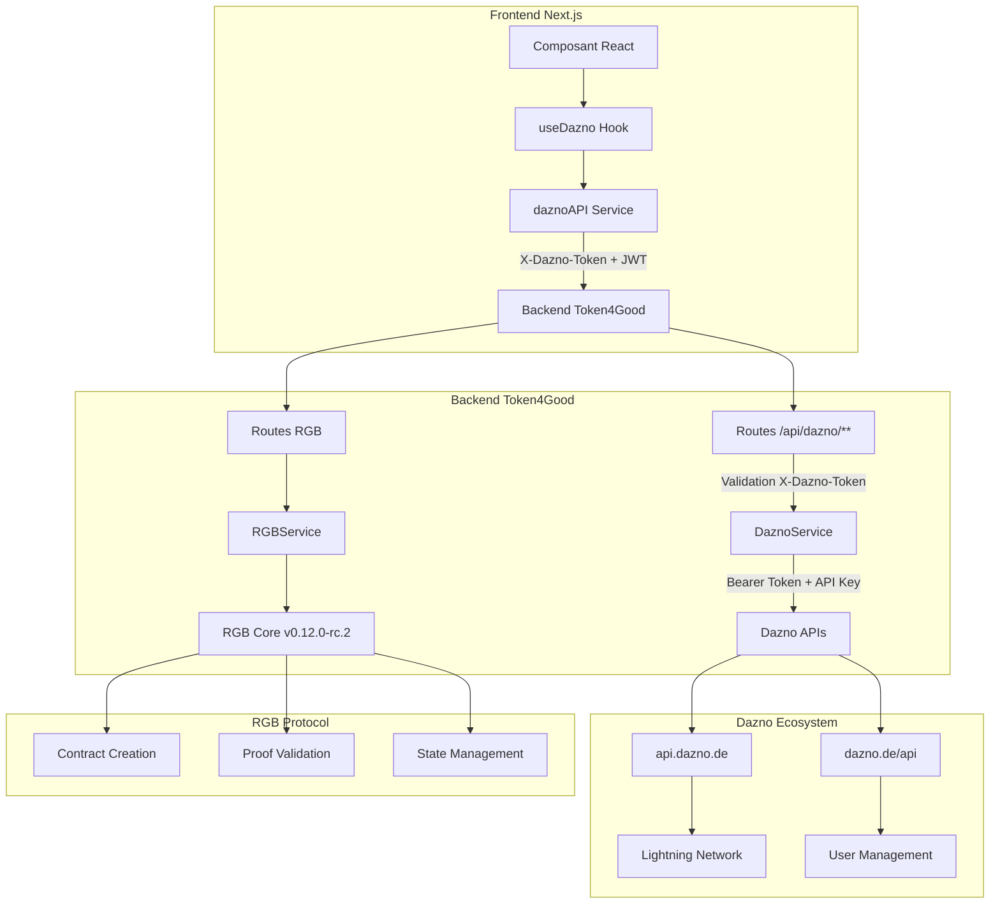

# 🚀 Guide d'Intégration Complet - Token4Good RGB + Dazno

## ✅ État Actuel du Déploiement

### Backend (Déployé sur http://147.79.101.32:3000)
- ✅ **RGB Protocol v0.12.0-rc.2** intégré
- ✅ **Service Dazno** refactorisé avec auth sécurisée
- ✅ **Routes `/api/dazno/**`** avec header `X-Dazno-Token` obligatoire
- ✅ **Variables d'environnement** Dazno configurées
- ✅ **Contrôle d'accès** (propriétaire/admin/service_provider)
- ✅ **Traduction des erreurs** Dazno en codes HTTP

### Frontend (Prêt à intégrer)
- ✅ **Service API Dazno** (`services/daznoAPI.ts`)
- ✅ **Hook React useDazno** (`hooks/useDazno.ts`)
- ✅ **Composant Wallet** (`components/connected/DaznoWallet.tsx`)
- ✅ **Gestion automatique** des headers X-Dazno-Token

## 🔧 Intégration Frontend - Étapes Rapides

### 1. Installer les fichiers créés

```bash
# Copier les fichiers dans votre projet
cp RGB/apps/dapp/services/daznoAPI.ts apps/dapp/services/
cp RGB/apps/dapp/hooks/useDazno.ts apps/dapp/hooks/
cp RGB/apps/dapp/components/connected/DaznoWallet.tsx apps/dapp/components/connected/
```

### 2. Ajouter la variable d'environnement

```env
# apps/dapp/.env.local
NEXT_PUBLIC_API_URL=http://147.79.101.32:3000
```

### 3. Utiliser le composant Wallet

```tsx
// Dans une page ou composant
import { DaznoWallet } from '../components/connected/DaznoWallet';
import { useDazno } from '../hooks/useDazno';

function WalletPage() {
  const { isAuthenticated, authenticateWithDazno } = useDazno('user-123');

  const handleDaznoLogin = async () => {
    // Récupérer le token depuis votre système d'auth Dazno
    const daznoToken = await yourDaznoOAuthFunction();
    
    // S'authentifier avec Token4Good
    await authenticateWithDazno(daznoToken);
  };

  return (
    <div>
      {!isAuthenticated ? (
        <button onClick={handleDaznoLogin}>
          Se connecter avec Dazno
        </button>
      ) : (
        <DaznoWallet userId="user-123" userRole="mentor" />
      )}
    </div>
  );
}
```

### 4. Utiliser les API Dazno dans vos composants

```tsx
import { daznoAPI } from '../services/daznoAPI';
import { useDazno } from '../hooks/useDazno';

function MentoringComponent() {
  const { 
    t4gBalance, 
    createInvoice, 
    addPoints,
    error 
  } = useDazno('user-123');

  const handleSessionCompleted = async () => {
    try {
      // Ajouter des points de gamification
      await addPoints(20, 'mentoring_session_completed');
      
      // Créer une invoice pour le paiement
      const invoice = await createInvoice(1000, 'Session de mentoring');
      
      console.log('Invoice créée:', invoice.payment_request);
    } catch (err) {
      console.error('Erreur:', err);
    }
  };

  return (
    <div>
      <h3>Solde T4G: {t4gBalance?.t4g_balance || 0}</h3>
      <button onClick={handleSessionCompleted}>
        Terminer la session
      </button>
      {error && <div className="error">{error}</div>}
    </div>
  );
}
```

## 📋 Architecture Complète



## 🔐 Flux d'Authentification

```typescript
// 1. Connexion Dazno (côté frontend)
const daznoToken = await getDaznoOAuthToken();

// 2. Vérification avec Token4Good
const authData = await daznoAPI.verifyDaznoSession(daznoToken);
// → Stocke le JWT Token4Good + Dazno Token

// 3. Utilisation des API Dazno
await daznoAPI.getUserProfile('user-123');
// → Headers: Authorization: Bearer JWT, X-Dazno-Token: dazno-token

// 4. Backend valide les deux tokens
// → JWT pour Token4Good auth
// → X-Dazno-Token pour Dazno API access
```

## 🛠️ Endpoints Disponibles

### Backend Token4Good
```
http://147.79.101.32:3000
├── /health                          # Status RGB + Dazno
├── /api/auth/dazeno/verify          # Auth Dazno
├── /api/mentoring/proofs            # RGB Proofs
└── /api/dazno/                      # Requires X-Dazno-Token
    ├── users/:id/profile            # Profil utilisateur
    ├── users/:id/tokens/t4g         # Solde T4G
    ├── users/:id/gamification       # Points
    ├── lightning/invoice            # Créer invoice
    ├── lightning/pay                # Payer invoice
    ├── lightning/balance/:id        # Solde Lightning
    └── lightning/transactions/:id   # Historique
```

### Dazno APIs (proxifiées)
```
https://api.dazno.de        # Lightning Network
https://dazno.de/api        # User Management
```

## 🎯 Tests Frontend

```typescript
// Test d'intégration complet
describe('Intégration Dazno', () => {
  test('Authentification et récupération données', async () => {
    // Mock du token Dazno
    const mockDaznoToken = 'dazno-token-123';
    
    // Authentification
    const authData = await daznoAPI.verifyDaznoSession(mockDaznoToken);
    expect(authData.authenticated).toBe(true);
    
    // Récupération du profil
    const profile = await daznoAPI.getUserProfile('user-123');
    expect(profile.id).toBe('user-123');
    
    // Test du solde T4G
    const balance = await daznoAPI.getT4GBalance('user-123');
    expect(balance.t4g_balance).toBeGreaterThanOrEqual(0);
  });
  
  test('Gestion des erreurs X-Dazno-Token', async () => {
    // Effacer le token Dazno
    daznoAPI.clearTokens();
    
    // Tenter un appel API
    await expect(daznoAPI.getUserProfile('user-123'))
      .rejects.toThrow('X-Dazno-Token manquant');
  });
});
```

## 🔄 Mise à jour de l'existant

### 1. Mettre à jour les services existants

```typescript
// Remplacer les appels directs à reqwest par daznoAPI
// AVANT:
const response = await fetch('https://api.dazno.de/lightning/balance');

// APRÈS:
const balance = await daznoAPI.getLightningBalance(userId);
```

### 2. Ajouter la gestion des tokens

```typescript
// Dans votre système d'auth existant
export const authService = {
  async loginWithDazno(daznoOAuthToken: string) {
    // S'authentifier avec Token4Good + Dazno
    const result = await daznoAPI.verifyDaznoSession(daznoOAuthToken);
    
    // Stocker les tokens
    localStorage.setItem('token', result.token);
    sessionStorage.setItem('dazno-token', daznoOAuthToken);
    
    return result;
  }
};
```

## 📊 Monitoring & Debug

```typescript
// Logger pour debug
daznoAPI.setDebugMode(true); // Active les logs

// Vérifier l'état d'authentification
console.log('Dazno authentifié:', daznoAPI.isAuthenticated());
console.log('Token Dazno:', daznoAPI.getDaznoToken());

// Test de connectivité backend
const health = await fetch('http://147.79.101.32:3000/health');
console.log('Backend status:', await health.json());
```

## 🚀 Prochaines Étapes

1. **Intégrer le composant DaznoWallet** dans vos pages
2. **Mettre à jour l'auth** pour gérer les tokens Dazno
3. **Remplacer les appels Lightning** par les nouvelles API
4. **Tester les permissions** (owner/admin/service_provider)
5. **Déployer en staging** pour tests complets

## 📞 Support

- **Backend RGB+Dazno**: http://147.79.101.32:3000/health
- **Documentation API**: `/api/dazno/**` avec header `X-Dazno-Token`
- **Logs**: Backend disponible pour debug via SSH

L'intégration est **prête à utiliser** ! Il suffit d'ajouter l'envoi du header `X-Dazno-Token` côté frontend pour exploiter toutes les nouvelles fonctionnalités Dazno.